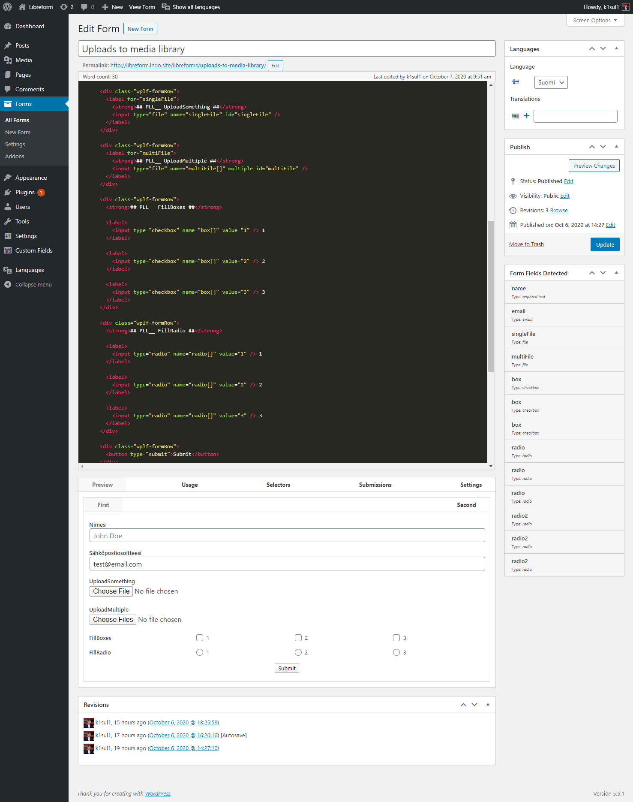
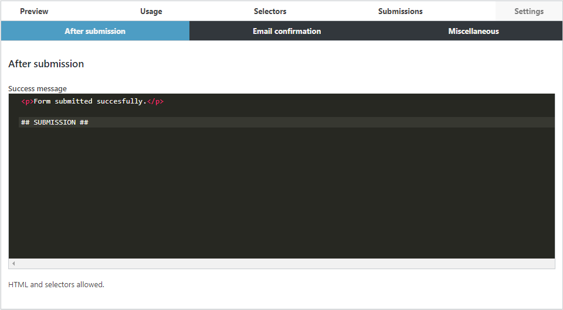

# WP Libre Form

[]([travis]) [![npm][npm-badge]][npm] [](https://packagist.org/packages/libreform/libreform) [](https://packagist.org/packages/libreform/libreform) [](https://packagist.org/packages/libreform/libreform)

[npm-badge]: https://img.shields.io/npm/v/@libreform/libreform.png?style=flat-square
[npm]: https://www.npmjs.org/package/@libreform/libreform

Use standard HTML5 markup to create fully functional forms for WordPress.

[The older 1.5 branch](https://github.com/libreform/wp-libre-form) is not maintained anymore, and will not receive any updates, unless someone steps up to do so. Wouldn't recommend it though.

## Features

- Forms are made of plain ol' HTML5; Type it in and it comes out as you intended.
- Works with any[\*](docs/limitations.md) valid HTML form. Just copy a form from a website and it should just work.
- Submissions are saved to the database, each form has it's own table for the submissions
- Forms are stored in a custom post type `libreform`, and the accompanying data is in `wp_postmeta`. Importing and exporting your forms is as easy as ever.
- Forms are submitted with AJAX by default, but falls back to traditional methods if necessary.
- Validates fields tagged with the native HTML5 `required` attribute. Can be extended to validate `pattern` attribute if necessary.
- **It's hackable.** Add your own functionality with hooks and APIs. Frontend and backend.
- Email notifications of received form submissions
- File upload support to Media Library and outside with input type=file
- Multilingual support with Polylang
- Imported HTML templates for forms
- Selectors like `## USER_EMAIL ##`, `## SUBMISSION ##` and `## FORM ##`. Think of it as safe eval. Did we mention it's easy to create more of these yourself?
- JavaScript API, written in TypeScript

## Why?

Modern HTML markup is a great way to build forms. With Libre Form, there's no need to use clunky form builders that are hard to customise. Ever tried building a pixel perfect implementation of a form design? It's drastically harder when you don't control the markup.

WP Libre Form is built upon the "WYSIWYG" principle. We use the HTML you supply _somewhat_ as-is. We only parse it for selectors and minify it, so `wpautop` doesn't murder it.

## Server requirements

- PHP 7.3 or newer

## Further reading

- [Architecture](docs/architecture.md)
- [API](docs/API.md)
- [Actions](docs/actions.md)
- [FAQ](docs/FAQ.md)
- [Filters](docs/filters.md)
- [Limitations](docs/limitations.md)
- [List of examples](docs/examples.md)

## New in 2.0

The plugin has been rewritten from the ground up, breaking backwards compatibility. In other words; WPLF 1.5 is dead, long live WPLF 2.0!

Nothing in particular was wrong with 1.5, but it was getting a little annoying to maintain. The original version was written during ONE WordCamp, and we had added countless new features since that. You can still use the old version, it works as long as WordPress doesn't break backwards compatibility.

As migrations tend to be a pain in the ass, we've made special efforts to ensure that you don't have to migrate. The new version works side by side with the old one. Everything has been renamed so they do not conflict with each other.

Some key changes;

- New directory and slug, from `wp-libre-form` to `libreform`
- Shortcode has been renamed to `libreform` from `libre-form`
- The form post type is now `libreform` (the old one was `wplf-form`)
- API has been camelCase'd
- Actions and hooks have been renamed
- Form submissions live in separate database tables now, each form gets a table.

## Screenshots

### Form edit screen



### Rendered form in the default 2020 theme


### Email confirmation


### Success message



## Installation

### The Composer Way (preferred)

Install the plugin via [Composer](https://getcomposer.org/)

```
composer require libreform/libreform
```

Activate the plugin

```
wp plugin activate libreform
```

### WordPress.org?

This plugin will not be released on wordpress.org. During the review process, instead of actually reviewing the plugin, Plugin Review Team just wasted my time. They kept arguing that we need to merge the two codebases together and "provide an upgrade" path, despite 2.0 being entirely backwards incompatible. They do not understand how never breaking backwards compatibility is harmful. Can't blame them, 15 years of legacy would turn anyone's brain into soup.

I told them that the plugins are fundamentally different, we have different PHP & browser requirements, etc. Doing what they required would've taken WEEKS for no benefit whatsoever.

The opposite actually. The likelihood of end users updating blindly to 2.0 and breaking literally every form they have is too damn high. Writing migrations takes time, and for what benefit? We do not make any money from this, but you as an enduser hopefully do. The time it takes you to manually migrate 10 forms is most likely billable time, and shouldn't take more than a minute per form.

You can run 1.5 and 2.0 side by side without any issues. That wouldn't be possible with their demands. Instead, every form would have to be migrated, writing migrations would take an absurd amount of time, and there would be no guarantee of them working, considering the "just hack around it" mentality in 1.5.

So, if you don't want to use Composer to manage the plugin, download the latest release from GitHub. There are plans to integrate an update mechanism to the plugin, but no timeline for that has been established yet. Contributions are welcome.
